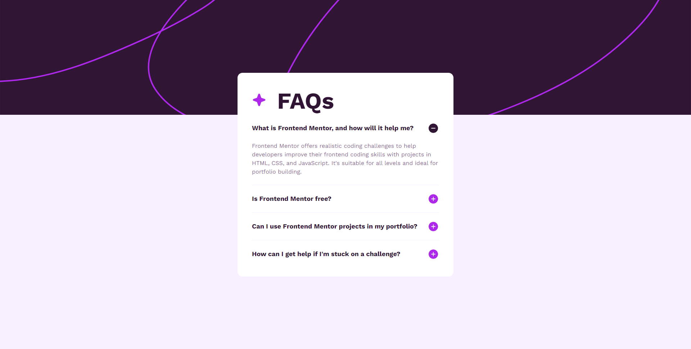
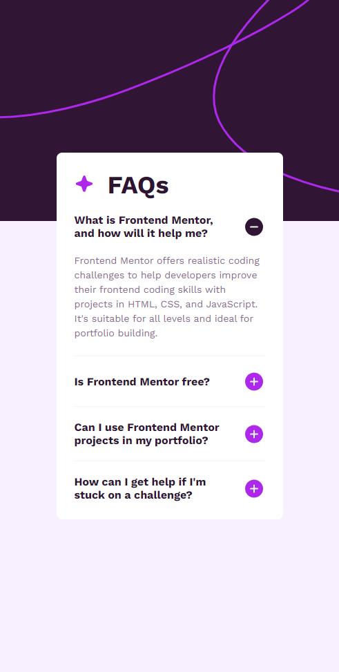

# Frontend Mentor - FAQ accordion solution

This is a solution to the [FAQ accordion challenge on Frontend Mentor](https://www.frontendmentor.io/challenges/faq-accordion-wyfFdeBwBz). Frontend Mentor challenges help you improve your coding skills by building realistic projects.

## Table of contents

- [Overview](#overview)
  - [The challenge](#the-challenge)
  - [Screenshot](#screenshot)
  - [Links](#links)
- [My process](#my-process)
  - [Built with](#built-with)
  - [What I learned](#what-i-learned)
- [Author](#author)

## Overview

### The challenge

Users should be able to:

- Hide/Show the answer to a question when the question is clicked
- Navigate the questions and hide/show answers using keyboard navigation alone
- View the optimal layout for the interface depending on their device's screen size
- See hover and focus states for all interactive elements on the page

### Screenshot




### Links

- Solution URL: [Click here](https://www.frontendmentor.io/solutions/responsive-faq-accordion-main-jOFvB4bxj9)
- Live Site URL: [Click here](https://fmfaqaccordionmain.netlify.app/)

## My process

### Built with

- Semantic HTML5 markup
- CSS custom properties
- Flexbox
- JavaScript

### What I learned

I learned this peace of code

```js
for (let i = 0; i < buttons.length; i++) {
  buttons[i].addEventListener("click", function () {
    buttons[i].classList.toggle("active-accordion");

    for (let i = 0; i < contents.length; i++) {
      if (buttons[i].classList.contains("active-accordion")) {
        contents[i].classList.add("active");
      } else {
        contents[i].classList.remove("active");
      }
    }
  });
}
```

## Author

- Frontend Mentor - [@Alencode](https://www.frontendmentor.io/profile/Alencode-dev)
